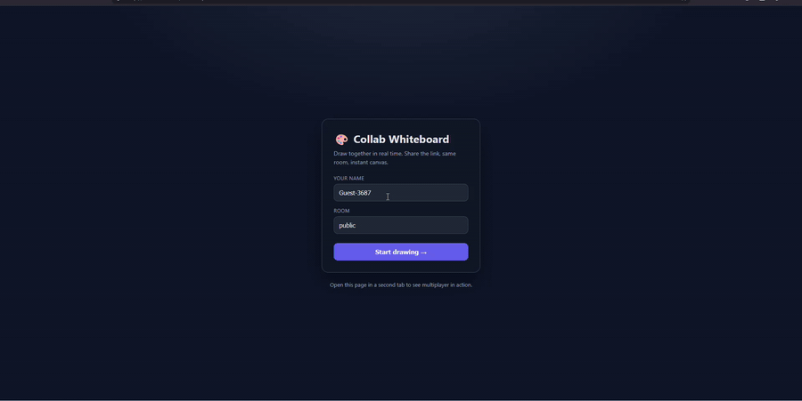

# 🎨 Collab Whiteboard

[](https://github.com/afraidsoul76/collab-whiteboard/actions/workflows/ci.yml)
[](LICENSE)
[](https://nodejs.org/)
[](https://render.com)

A **real-time collaborative whiteboard**. Open it in two tabs (or send a friend the link), pick the same room, and draw together — strokes, live cursors, and presence sync instantly over WebSockets.

Built with **React + TypeScript** on the front end and a **Node + Socket.IO** server on the back, wired together as a single npm-workspaces monorepo and deployed as a single service.

**🔗 Try it live: [collab-whiteboard-ydn2.onrender.com](https://collab-whiteboard-ydn2.onrender.com)**
_(free-tier host — first request after ~15 min of inactivity takes ~30 s to wake up)_



---

## ✨ Features

- **Live multiplayer drawing** — every stroke broadcasts to everyone in the room in real time, and you see other people's strokes *grow* as they draw (not just when they finish).
- **Full tool palette** — pen, eraser, line, arrow, rectangle, ellipse, and a text tool.
- **Multiplayer undo / redo** — per-user history, synced to everyone. Undo removes exactly *your* last item without touching anyone else's. `Ctrl/Cmd+Z` and `Ctrl/Cmd+Shift+Z` work too.
- **Live cursors** — see where each participant is pointing, labeled with their name and color.
- **Built-in chat** — a slide-out panel with unread badges, so collaborators can talk while they draw.
- **Export as PNG** — download the current board as an image (white background composited in).
- **Presence** — avatars and an online count update as people join and leave.
- **Rooms via shareable links** — `?room=team-standup` puts everyone on the same board; one click copies the invite link.
- **Late-joiner replay** — the server keeps board state + recent chat, so people who join late see everything already there.
- **Resolution-independent** — coordinates are normalized (0–1), so a board drawn on a laptop looks right on a phone.
- **Retina-crisp, two-layer canvas** — a static layer for committed art and a separate live layer for in-progress strokes, keeping redraws cheap. Device-pixel-ratio aware.

## 🧱 Tech stack

| Layer     | Tech                                             |
| --------- | ------------------------------------------------ |
| Front end | React 18, TypeScript, Vite, HTML5 Canvas         |
| Realtime  | Socket.IO (client + server)                      |
| Server    | Node.js, Express, TypeScript                      |
| Tooling   | npm workspaces, tsx, GitHub Actions CI           |

## 🚀 Getting started

```bash
# 1. Install everything (root installs both workspaces)
npm install

# 2. Run client + server together in dev mode
npm run dev
```

- Client: <http://localhost:5173>
- Server: <http://localhost:3001>

Open the client URL in **two browser windows** to see multiplayer in action. Share the link (it includes `?room=`) to draw with someone else.

### Production build

```bash
npm run build     # builds the client, then compiles the server
npm start         # serves the built client AND the socket server on :3001
```

In production the Express server serves the compiled client bundle, so the whole
app runs as a single service on one port.

### Deploy to Render (free)

This repo ships a [`render.yaml`](render.yaml) blueprint. To deploy:

1. Sign up at [render.com](https://render.com) and connect your GitHub account.
2. **New → Blueprint**, pick this repo, click **Apply**.
3. Render reads `render.yaml`, provisions a free Node web service, runs
   `npm ci && npm run build`, and boots `npm start`. Health check at `/health`.

That's it — the app is live at `https://<your-service>.onrender.com`. First
request after 15 min of inactivity spins the free instance back up (~30 s).

### Tests

```bash
npm test
```

Runs the server test suite ([`server/src/app.test.ts`](server/src/app.test.ts))
against a real Socket.IO server on an ephemeral port. Covers `/health`,
add/undo/redo broadcast, per-user undo isolation, cursor fan-out, room
garbage collection, `clear`, and late-joiner state replay.

## 🗂️ Project structure

```
collab-whiteboard/
├── client/                 # React + Vite front end
│   └── src/
│       ├── App.tsx         # join screen (name + room)
│       ├── socket.ts       # Socket.IO client singleton
│       ├── draw.ts         # item → canvas renderer (shared with PNG export)
│       ├── types.ts        # shared event/data types
│       └── components/
│           ├── Board.tsx   # two-layer canvas, tools, undo/redo, cursors, export
│           ├── Toolbar.tsx # tools, colors, sizes, undo/redo, export, clear
│           └── Chat.tsx    # slide-out chat panel
├── server/                 # Node + Socket.IO back end
│   └── src/
│       ├── app.ts          # factory: rooms, broadcast, presence, static hosting
│       ├── index.ts        # entrypoint: builds app + listens on PORT
│       ├── app.test.ts     # end-to-end Socket.IO tests (vitest)
│       └── types.ts        # shared event/data types
├── render.yaml             # one-click deploy blueprint
└── package.json            # npm workspaces + dev/build scripts
```

## 🔌 How the realtime layer works

Everything on the board is a typed **`Item`** — a `path` (pen/eraser), a `shape`
(rect/ellipse/line/arrow), or `text`. Each item carries an `id` and an `owner`,
which is exactly what makes per-user undo possible: the server can find and
remove *your* last item without disturbing anyone else's. Coordinates are always
normalized to `0..1`.

**Client → Server**

| Event    | Payload            | Meaning                                     |
| -------- | ------------------ | ------------------------------------------- |
| `join`   | `{ room, name }`   | enter a room                                |
| `live`   | `Item`             | in-progress preview while drawing (not saved)|
| `add`    | `Item`             | commit a finished item                      |
| `undo`   | –                  | undo my most recent item                    |
| `redo`   | –                  | redo my most recently undone item           |
| `cursor` | `{ x, y }`         | pointer moved (throttled ~25/sec)           |
| `chat`   | `text`             | send a chat message                         |
| `clear`  | –                  | wipe the board for the room                 |

**Server → Client**

| Event          | Payload                        | Meaning                            |
| -------------- | ------------------------------ | ---------------------------------- |
| `init`         | `{ you, items, users, chat }`  | your identity + full board on join |
| `live`         | `Item`                         | someone's in-progress preview      |
| `add`          | `Item`                         | an item was committed              |
| `remove`       | `id`                           | an item was undone/removed         |
| `presence`     | `User[]`                       | the room's roster changed          |
| `cursor`       | `{ id, x, y }`                 | someone else's cursor moved        |
| `cursor:leave` | `id`                           | remove a departed user's cursor    |
| `chat`         | `ChatMessage`                  | a chat message arrived             |
| `clear`        | –                              | board was cleared                  |

The server keeps per-room state — ordered `items`, `users`, recent `chat`, and a
per-user redo stack — in memory. While you draw, `live` events stream the
in-progress item so others watch the line grow; on release, one `add` commits it.
`undo`/`redo` are resolved server-side and echoed to everyone so all clients stay
consistent. Empty rooms are garbage-collected when the last person leaves.

The client renders on **two stacked canvases**: a base layer for committed items
(redrawn only when the item set changes) and a live layer for in-progress strokes
(redrawn every frame). That split keeps interaction smooth even on a busy board.

## 🧭 Roadmap / ideas

Good next steps if you want to keep extending it:

- Persist boards (Redis or Postgres) so they survive server restarts
- Selection + move/delete of existing items
- Multiple pages / infinite canvas with pan & zoom
- Sticky notes and image paste
- Auth + private rooms

## 📄 License

MIT — see [LICENSE](LICENSE).
